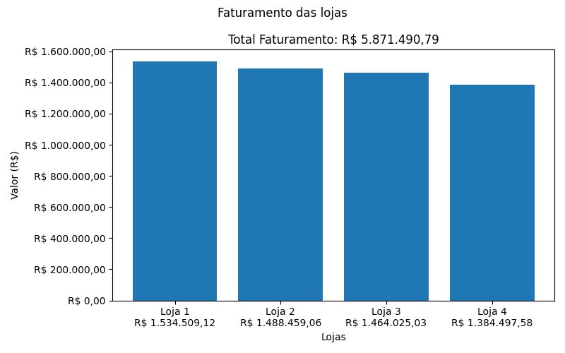
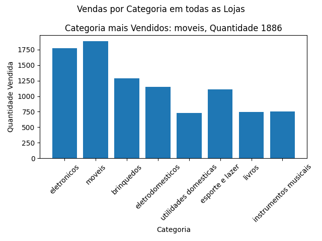
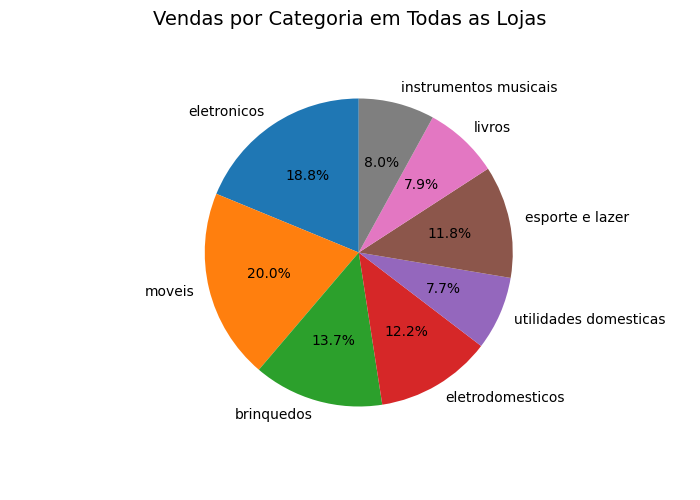
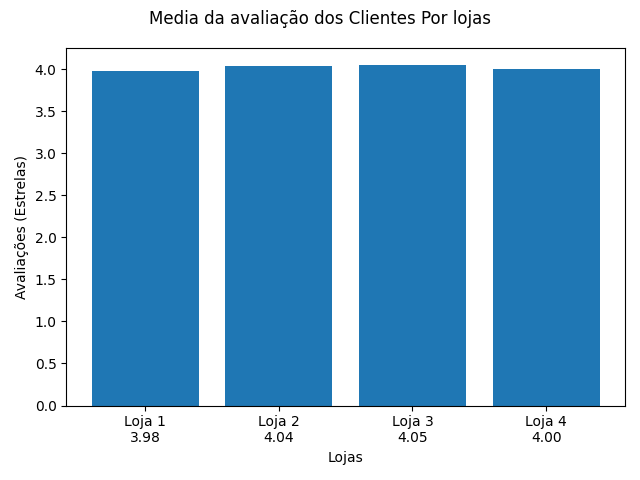
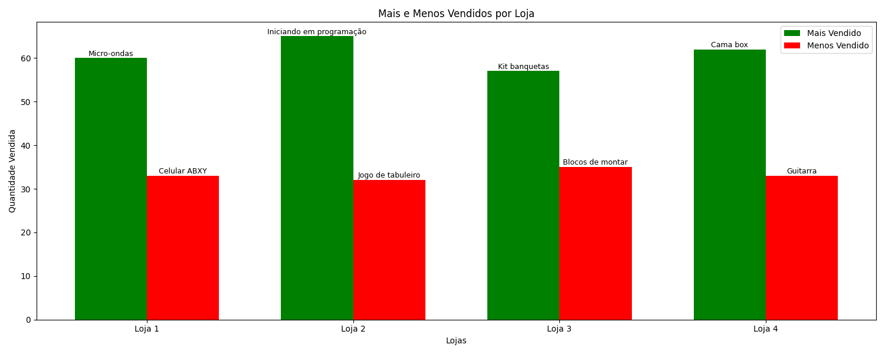
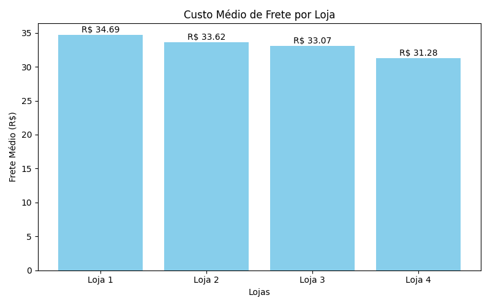

# 📊 Análise de Lojas do Seu João

Este projeto tem como objetivo analisar os dados de diferentes lojas administradas pelo Seu João para ajudá-lo a tomar a melhor decisão sobre **qual loja vender**. A análise contempla aspectos como faturamento, avaliação dos clientes, produtos vendidos e custos com frete, além de mapas interativos para melhor visualização espacial das vendas.

---

## 🔢 Faturamento Total de Cada Loja

📌 *Resumo:*  
Loja 1 teve o maior faturou enquanto a Loja 4 teve o menor faturamento.

---

## 🧾 Vendas por Categoria
# Individual

# Juntas

📌 *Resumo:*  
Na maioria das lojas produtos das categorias Moveis e Eletrodomesticos foram os mais vendidos, enquanto utilitarios domesticos, instrumentos musicais e livros tiveram menos vendas.

---

## ⭐ Média de Avaliação por Loja

📌 *Resumo:*  
Todas as lojas tiveram avaliações por volta de 4 estrelas, tendo somente a loja 1 pouco abaixo um com 3,98.
Levando em conta que o maximo é 5 estrelas, os cliente estão satisfeitos com as lojas. 

---

## 📦 Produtos Mais e Menos Vendidos

📌 *Resumo:*  
O mais vendidos das lojas são das categorias movéis ou eletrodomesticos, exceto na loja 2 e 3, na qual os mais vendido são respectivamente livro, instrumento musical.

---

## 🚚 Frete Médio por Loja

📌 *Resumo:*  
A loja 4 tem o frete mais barato, já loja 1 tem o mais caro, porem os valores variam pouco entre 35 há 30 reais.

---

## 🗺️ Heatmap de Vendas

🔗 [🔍 Clique aqui para abrir o mapa interativo](https://jojonior.github.io/ChallengeAluraStore/heatmap_vendas.html)

📌 *Resumo:*  
Olhando no mapa, é possivel notar que as regiões costeiras tem mais clientes.

---

## 🗺️ Mapa de Vendas com Camadas por Loja

🔗 [🔍 Clique aqui para abrir o mapa interativo com camadas](https://jojonior.github.io/ChallengeAluraStore/paginas/mapa_interativo_lojas.html)

📌 *Resumo:*  
Assim é possivel quais ponto recebem produtos das lojas, com um sistema de camada por loja.

---

### ✅ Conclusão e Recomendação

Após considerar todos os aspectos analisados, recomendamos que o Seu João **venda a loja 4**, pois:

- Tem o menor faturamento
- Tem a segunda menor avaliação
- Tem a menor dispersão de vendas

As demais lojas apresentam um desempenho bom, e podem representar melhor retorno a longo prazo.

---

## 🛠️ Tecnologias Utilizadas

- Python + Pandas  
- Matplotlib  
- Folium  
- Numpy 
- Git + GitHub
- Vscode  

